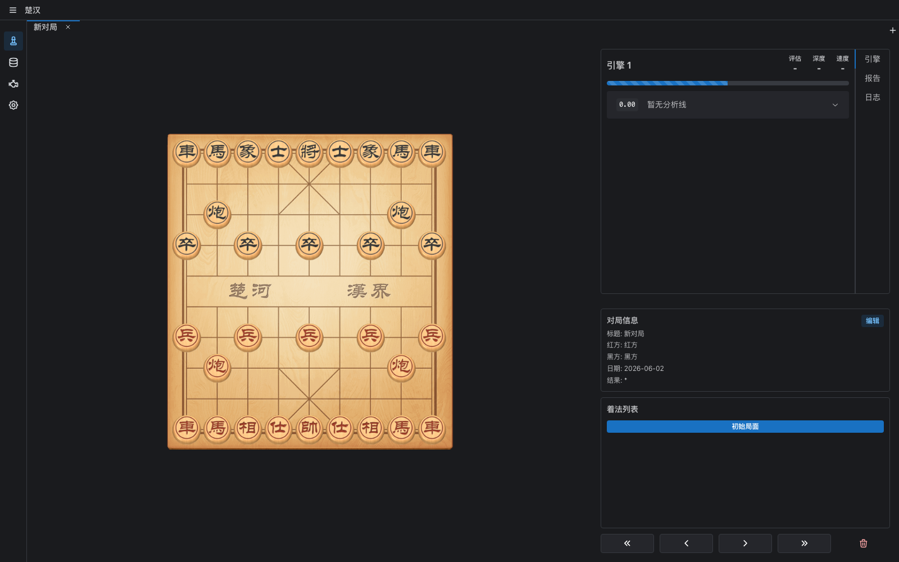

# 楚汉 (Chuhan)

<br />
<div align="center">
  <a href=".">
    
  </a>

  <h3 align="center">楚汉</h3>

  <p align="center">
    A modern Chinese chess toolkit
    <br />
    跨平台中国象棋 GUI，面向棋谱研究、引擎分析与桌面对弈体验。
    <br />
    <br />
    <a href="#功能">功能</a>
    ·
    <a href="#从源码构建">从源码构建</a>
    ·
    <a href="#技术栈">技术栈</a>
  </p>
</div>

楚汉是一个基于 Tauri + React 的开源中国象棋桌面应用。它希望提供接近现代国际象棋 GUI 的工作流：清晰的棋盘、可调整的分析布局、多标签研究空间、棋谱导入和引擎分析面板。

UI 布局和部分交互体验参考了 [En Croissant](https://github.com/franciscoBSalgueiro/en-croissant)，但楚汉专注于中国象棋。

## 功能

- 中国象棋棋盘研究：新建局面、走子、回放、删除当前着法。
- 合法着法提示、吃子提示、选子高亮与走子音效。
- 多标签工作区：新建标签会进入模式选择卡片页，支持标签拖拽排序。
- 可调整分析布局：棋盘、引擎面板、对局信息和着法列表可以在同一工作台中查看。
- UBB 棋谱导入、最近文件记录和基础棋谱树管理。
- 引擎面板基础：评估、深度、速度、PV、报告和日志视图。
- 响应式棋盘分析页面，适配较窄窗口。



## 从源码构建

请先根据你的系统安装 [Tauri prerequisites](https://tauri.app/start/prerequisites/)。

本项目使用 npm 管理前端依赖，并需要：

- [Node.js](https://nodejs.org/) 20 或更高版本
- [Rust](https://www.rust-lang.org/) 1.77.2 或更高版本

```bash
git clone <repo-url> chuhan
cd chuhan
npm install
```

仅启动前端开发服务器：

```bash
npm run dev
```

启动 Tauri 桌面开发模式：

```bash
npm run tauri -- dev
```

构建前端：

```bash
npm run build
```

构建桌面应用：

```bash
npm run tauri -- build
```

构建产物位于 `src-tauri/target/release/bundle/`。

## 技术栈

| 层级 | 技术 |
| --- | --- |
| 桌面壳 | Tauri v2 |
| 前端框架 | React 19 + TypeScript |
| 构建工具 | Vite 6 |
| UI 组件 | Mantine v7 |
| 状态管理 | Zustand + Jotai |
| 面板布局 | react-mosaic-component |
| 标签拖拽 | @hello-pangea/dnd |
| 图表 | Recharts |
| 中国象棋规则/局面 | Wukong |

## 项目结构

```text
├── src/                         # React 前端源码
│   ├── components/
│   │   ├── boards/              # 棋盘、分析布局和棋盘工作区
│   │   │   ├── BoardV2.tsx
│   │   │   └── BoardAnalysis.tsx
│   │   ├── panels/analysis/     # 引擎分析、报告和日志面板
│   │   ├── tabs/                # 新建卡片页、标签栏和棋盘页面
│   │   ├── layout/              # 顶栏、侧栏和应用布局
│   │   ├── common/              # 通用展示组件
│   │   ├── GameInfo.tsx         # 对局信息
│   │   └── MoveList.tsx         # 着法列表
│   ├── hooks/                   # 引擎通信和音效 Hook
│   ├── state/                   # 棋谱树和全局 UI 状态
│   ├── styles/                  # 全局样式和布局覆盖
│   ├── types/                   # 中国象棋核心类型
│   └── utils/                   # UBB 解析等工具
├── src-tauri/                   # Tauri/Rust 后端和桌面配置
│   ├── src/                     # Rust 命令、引擎进程管理
│   ├── capabilities/            # Tauri 权限配置
│   └── icons/                   # 应用图标
├── public/assets/               # 棋盘、棋子、音效和背景资源
├── public/libs/                 # Wukong 等前端运行库
├── engines/                     # 本地引擎资源
└── docs/                        # README 展示资源
```

## 路线图

- 完善引擎管理页面和外部 UCI/UCCI 引擎配置。
- 完善数据库、设置等侧栏页面。
- 加强报告视图、棋谱导出和变例管理。
- 增加更多主题、棋盘和棋子资源选择。

## 许可证

本项目使用 MIT License。详见 [LICENSE](./LICENSE)。
